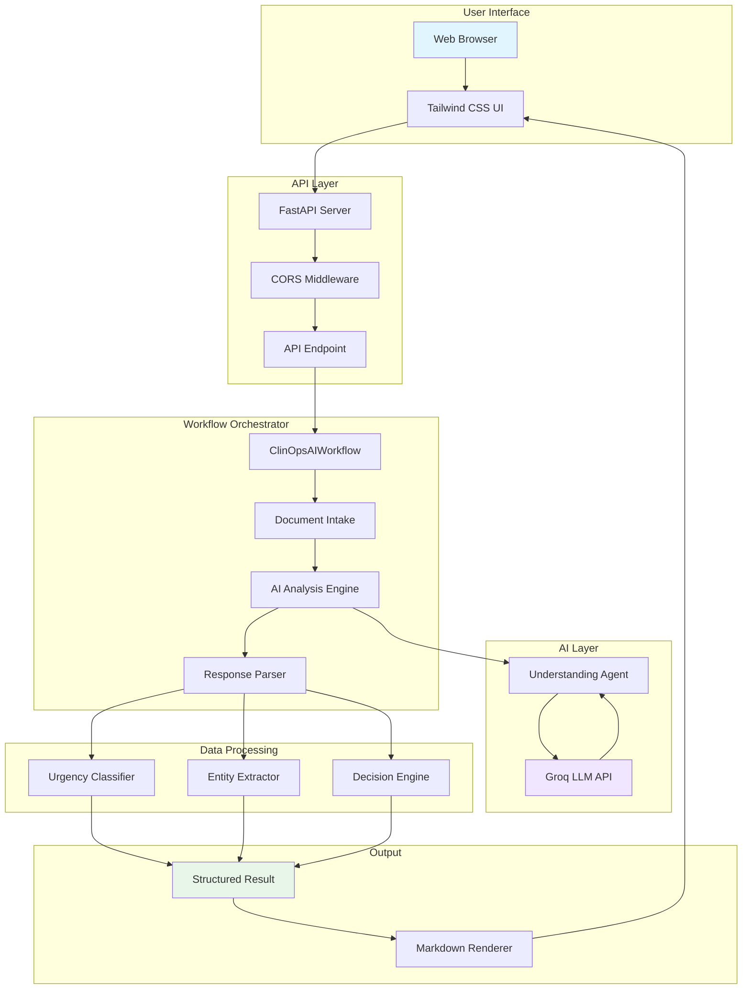
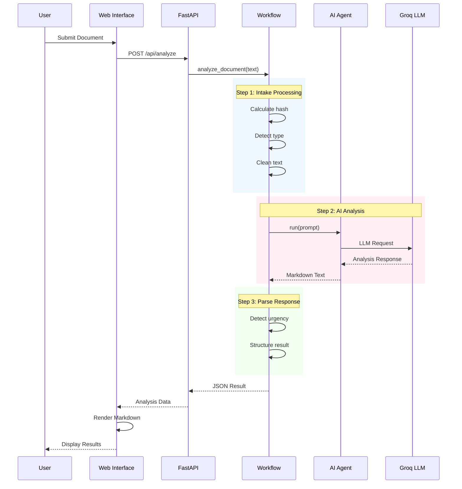
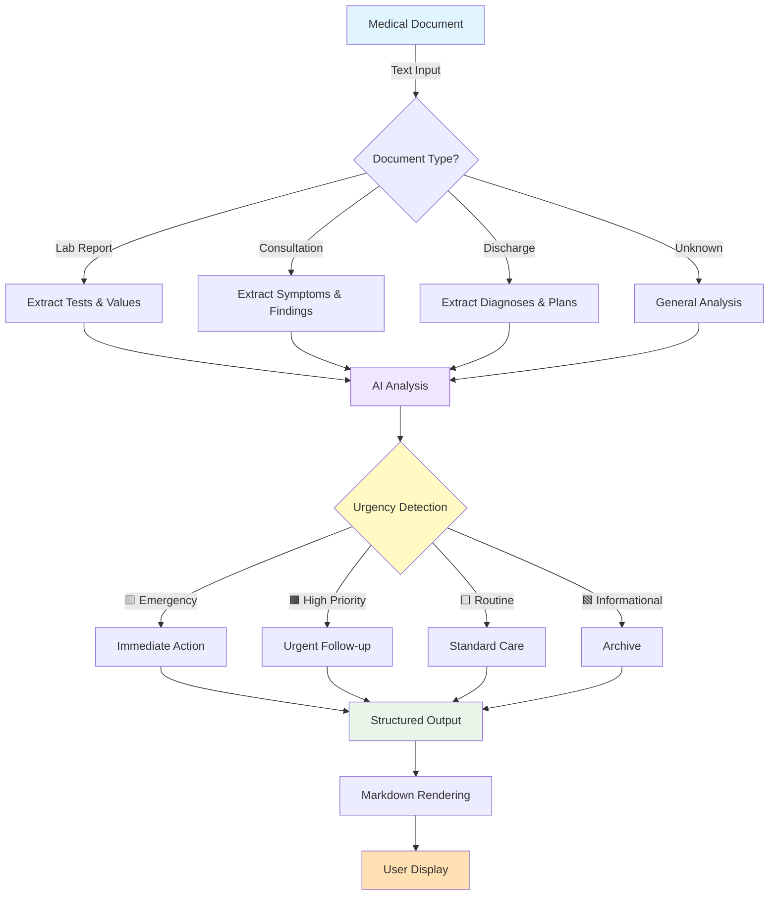
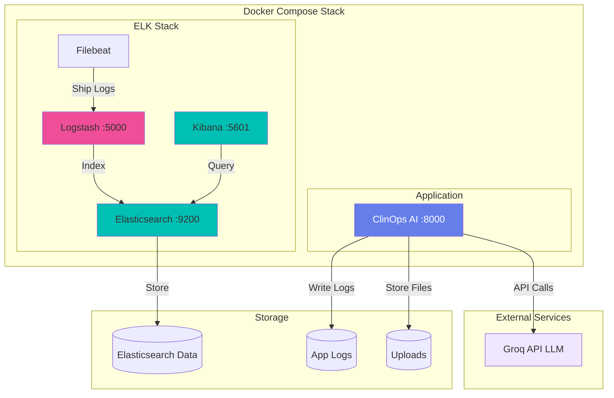

<div align="center">

# 🏥 ClinOps AI

### Autonomous Intelligence System for Medical Document Decisions

[](https://www.python.org/)
[](https://fastapi.tiangolo.com/)
[](https://groq.com/)
[](https://www.docker.com/)
[](LICENSE)

Transform raw medical documents into actionable clinical intelligence with AI-powered decision making, urgency assessment, and explainable recommendations.

[Quick Start](#-quick-start) • [Documentation](docs/) • [API Reference](docs/api.md) • [Deploy Guide](docs/deployment.md)

</div>

---

## 📊 System Architecture



---

## 🔄 Analysis Workflow



---

## 🔥 What Makes ClinOps AI Unique

Most systems build: **PDF → text → summary**

**ClinOps AI builds:** `PDF → understanding → decision → action`

This is **decision intelligence**, not just document processing.

---

## 🩺 The Problem

Medical organizations receive thousands of documents daily:
- 📄 Lab reports
- 📋 Referral letters
- 🏥 Discharge summaries
- 💊 Consultation notes
- 📠 Faxes (images + PDFs)

**Challenges:**
- ⚠️ Urgent cases get missed
- ⏱️ Manual triage is slow
- 😓 Doctors waste time reading irrelevant docs
- 📊 No structured intelligence layer

**ClinOps AI acts like an autonomous clinical coordinator.**

---

## ✨ Core Capabilities

### 1️⃣ Document Understanding
- Identifies document type automatically
- Extracts clinical intent and meaning
- Understands **context**, not just keywords

### 2️⃣ Clinical Urgency Reasoning
Classifies documents using AI reasoning:
- 🟥 **Emergency** - Immediate action required
- 🟧 **High Priority** - Urgent follow-up needed
- 🟨 **Routine** - Standard care pathway
- 🟩 **Informational** - For records only

### 3️⃣ Autonomous Decision Engine
Decides automatically:
- Notify doctor immediately
- Schedule specialist follow-up
- Create EMR task
- Store for records
- Escalate to emergency queue

### 4️⃣ Explainability Layer
For every decision:
- **WHY** it was made
- **Which data** triggered it
- **Confidence score**
- Complete decision trace

---

## 🧠 Agent-Based Architecture

```
┌─────────────────────┐
│   Document Input    │
└──────────┬──────────┘
           │
           ▼
┌─────────────────────┐
│   Intake Agent      │  (Validation, Deduplication)
└──────────┬──────────┘
           │
           ▼
┌─────────────────────┐
│   Vision Agent      │  (OCR, Layout Understanding)
└──────────┬──────────┘
           │
           ▼
┌─────────────────────┐
│ Understanding Agent │  (Entity Extraction, NLP)
└──────────┬──────────┘
           │
           ▼
┌─────────────────────┐
│  Urgency Agent      │  (Risk Assessment)
└──────────┬──────────┘
           │
           ▼
┌─────────────────────┐
│  Decision Agent     │  (Action Routing)
└──────────┬──────────┘
           │
           ▼
┌─────────────────────┐
│   Audit Agent       │  (Explanation, Compliance)
└─────────────────────┘
```

---

## 🚀 Quick Start

### Prerequisites
- Python 3.9+
- Groq API Key ([Get one here](https://console.groq.com))

### Installation

```bash
# Clone the repository
cd ClinOpsAI

# Create virtual environment
python -m venv venv
source venv/bin/activate  # On Windows: venv\Scripts\activate

# Install dependencies
pip install -r requirements.txt

# Set up environment
cp .env.example .env
# Edit .env and add your GROQ_API_KEY
```

### Running the Application

**Option 1: Web UI (Recommended)**
```bash
uvicorn api.main:app --reload
```
Then open http://localhost:8000 in your browser

**Option 2: CLI**
```bash
# Interactive mode
python main.py

# From file
python main.py path/to/medical_document.txt
```

---

## 📡 API Endpoints

### `GET /`
Serves the Tailwind CSS dashboard

### `GET /health`
Health check endpoint

### `POST /api/analyze`
Analyze medical document

**Request:**
```json
{
  "text": "Patient presents with chest pain, elevated Troponin..."
}
```

**Response:**
```json
{
  "urgency": "🟥 Emergency",
  "decision": "Notify doctor immediately",
  "document_type": "lab_report",
  "analysis": "Detailed clinical analysis...",
  "status": "completed"
}
```

---

---

## 🔀 Data Flow



---

## 🛠️ Technology Stack

| Component | Technology |
|-----------|-----------|
| **AI Framework** | [Agno](https://github.com/agno-agi/agno) |
| **LLM Provider** | [Groq](https://groq.com) (Llama 3.1 70B, Vision) |
| **Backend** | FastAPI |
| **Frontend** | HTML + Tailwind CSS |
| **Language** | Python 3.9+ |

---

## 📋 Example Use Cases

### Emergency Detection
```
Input: "Elevated Troponin I: 0.8 ng/mL, ST elevation in ECG"
Output: 🟥 Emergency - Immediate cardiology consult
```

### High Priority Referral
```
Input: "Significant decline in kidney function, eGFR: 28"
Output: 🟧 High Priority - Nephrology referral within 3 days
```

### Routine Follow-up
```
Input: "Blood pressure well controlled, continue current meds"
Output: 🟨 Routine - Schedule 6-month follow-up
```

---

## 🎯 Project Structure

```
ClinOpsAI/
├── api/
│   ├── main.py              # FastAPI application
│   └── templates/
│       └── index.html       # Tailwind UI
├── src/
│   ├── agents/              # Agent implementations
│   │   ├── intake.py
│   │   ├── vision.py
│   │   ├── understanding.py
│   │   ├── urgency.py
│   │   ├── decision.py
│   │   └── audit.py
│   ├── models/
│   │   └── schemas.py       # Pydantic models
│   └── workflow.py          # Team orchestrator
├── main.py                  # CLI entry point
├── requirements.txt
├── .env.example
└── README.md
```

---

## 🔐 Environment Variables

```env
GROQ_API_KEY=your_groq_api_key_here
```

---

## 🤝 Contributing

This is a demonstration project. For production use:
1. Add proper error handling
2. Implement database storage
3. Add authentication
4. Integrate with EMR systems
5. Add HIPAA compliance measures
6. Implement audit logging

---

## 📄 License

MIT License - feel free to use for your own projects

---

## 🙏 Acknowledgments

- Built with [Agno](https://docs.agno.com) multi-agent framework
- Powered by [Groq](https://groq.com) ultra-fast LLM inference
- UI designed with [Tailwind CSS](https://tailwindcss.com)

---

## 🚀 Future Roadmap

- [ ] Multi-language support
- [ ] Voice input for dictation
- [ ] Integration with FHIR standards
- [ ] Mobile app
- [ ] Real-time EMR integration
- [ ] Advanced analytics dashboard

---

---

## 🚢 Deployment Architecture



### Infrastructure Components

| Component | Purpose | Port |
|-----------|---------|------|
| **ClinOps AI** | Main application | 8000 |
| **Elasticsearch** | Log storage & search | 9200 |
| **Logstash** | Log processing | 5000 |
| **Kibana** | Log visualization | 5601 |
| **Filebeat** | Log shipping | - |

### Quick Deploy

```bash
# Clone repository
git clone <repo-url>
cd ClinOpsAI

# Set API key
echo "GROQ_API_KEY=your_key" > .env

# Start with ELK stack
docker-compose up -d

# Access services
# - App: http://localhost:8000
# - Kibana: http://localhost:5601
```

---

**Built with ❤️ for healthcare professionals**
