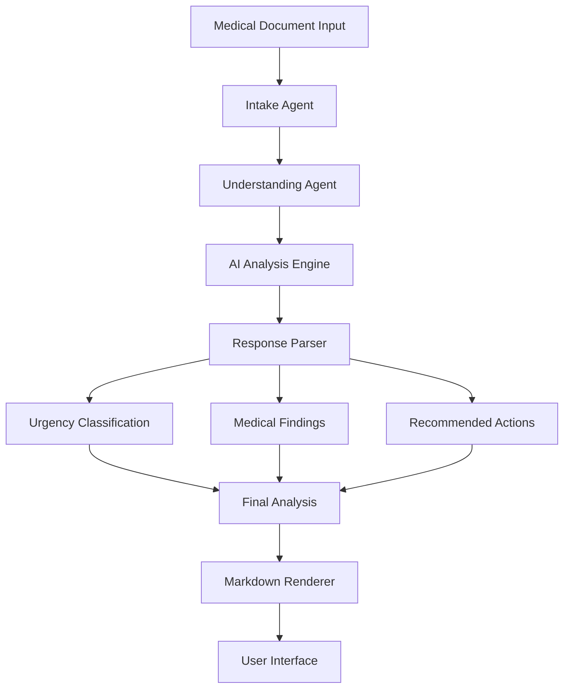

# ClinOps AI System Architecture

## Overview

ClinOps AI is an **Autonomous Intelligence System for Medical Document Decisions** built using a multi-agent architecture powered by Groq's LLMs.

## System Architecture



## Core Components

### 1. Frontend Layer
- **Technology**: HTML + Tailwind CSS + Marked.js
- **Purpose**: User interface for document input and result display
- **Features**:
  - Document text input
  - File upload support
  - Real-time analysis
  - Markdown rendering
  - Example documents

### 2. API Layer
- **Technology**: FastAPI
- **Purpose**: RESTful API for document analysis
- **Endpoints**:
  - `GET /` - Serve UI
  - `GET /health` - Health check
  - `POST /api/analyze` - Document analysis
  - `GET /api/stats` - System statistics

### 3. Workflow Orchestrator
- **File**: `src/workflow.py`
- **Class**: `ClinOpsAIWorkflow`
- **Purpose**: Coordinates the document analysis pipeline
- **Steps**:
  1. Document intake and preprocessing
  2. AI-powered analysis
  3. Response parsing and structuring
  4. Result formatting

### 4. Agent Layer
Six specialized AI agents, each with specific roles:

#### **Intake Agent** (`src/agents/intake.py`)
- Document validation
- Metadata extraction
- Content preprocessing
- Deduplication checks

#### **Understanding Agent** (`src/agents/understanding.py`)
- Medical entity extraction
- Symptom identification
- Lab result parsing
- Diagnosis extraction

#### **Urgency Agent** (`src/agents/urgency.py`)
- Clinical urgency assessment
- Risk stratification
- Priority determination

#### **Decision Agent** (`src/agents/decision.py`)
- Action recommendation
- Routing logic
- Timeline determination

#### **Audit Agent** (`src/agents/audit.py`)
- Explanation generation
- Decision trace logging
- Compliance documentation

#### **Vision Agent** (`src/agents/vision.py`)
- Image processing
- OCR capabilities
- PDF text extraction

## Data Flow

```
1. User Input
   ↓
2. FastAPI Endpoint (/api/analyze)
   ↓
3. ClinOpsAIWorkflow.analyze_document()
   ↓
4. Intake Processing
   ↓
5. AI Analysis (Understanding Agent)
   ↓
6. Response Parsing
   ↓
7. Urgency Detection
   ↓
8. Structured Result
   ↓
9. Markdown Rendering (Frontend)
   ↓
10. Display to User
```

## Technology Stack

| Layer | Technology |
|-------|-----------|
| **LLM** | Groq (meta-llama/llama-4-scout-17b-16e-instruct) |
| **Framework** | Agno (Multi-agent orchestration) |
| **Backend** | FastAPI |
| **Frontend** | HTML + Tailwind CSS |
| **Markdown** | Marked.js |
| **Logging** | Python logging (DEBUG level) |
| **Environment** | Python 3.12 |
| **Deployment** | Docker + Docker Compose |

## Urgency Classification System

The system classifies documents into 4 urgency levels:

| Level | Emoji | Description | Action |
|-------|-------|-------------|--------|
| **Emergency** | 🟥 | Life-threatening | Immediate action required |
| **High Priority** | 🟧 | Urgent, not life-threatening | Action within 24-48 hours |
| **Routine** | 🟨 | Standard follow-up | Scheduled care pathway |
| **Informational** | 🟩 | For records only | Archive |

## Scalability Considerations

### Current Implementation
- Single-agent analysis (Understanding Agent)
- Synchronous processing
- In-memory state

### Future Enhancements
- Multi-agent team orchestration
- Asynchronous processing with queues
- Database integration for persistence
- Caching layer for faster responses
- Load balancing for multiple instances

## Security & Compliance

### Current Features
- Environment variable configuration
- CORS middleware
- Input validation
- Error handling

### HIPAA Compliance (Future)
- Encryption at rest and in transit
- Audit logging
- Access control
- Data anonymization
- Secure credential management

## Monitoring & Observability

### Logging
- **Level**: DEBUG (highly detailed)
- **Format**: Timestamp + Logger + Level + Message
- **Coverage**:
  - Request/response tracking
  - Agent execution steps
  - Error stack traces
  - Performance metrics

### Future Monitoring
- Prometheus metrics
- Grafana dashboards
- Error tracking (Sentry)
- Performance APM

## Deployment Architecture

```
┌─────────────────────────────────────┐
│         Docker Container            │
│  ┌───────────────────────────────┐  │
│  │      FastAPI Application      │  │
│  │  ┌─────────────────────────┐  │  │
│  │  │   ClinOps AI Workflow   │  │  │
│  │  │  ┌──────────────────┐   │  │  │
│  │  │  │  Agent Layer     │   │  │  │
│  │  │  │  ┌────────────┐  │   │  │  │
│  │  │  │  │  Groq LLM  │  │   │  │  │
│  │  │  │  └────────────┘  │   │  │  │
│  │  │  └──────────────────┘   │  │  │
│  │  └─────────────────────────┘  │  │
│  └───────────────────────────────┘  │
│                                     │
│  Port: 8000                         │
└─────────────────────────────────────┘
```

## Configuration

### Environment Variables
- `GROQ_API_KEY` - Groq API authentication

### Runtime Settings
- Host: `0.0.0.0`
- Port: `8000`
- Reload: `True` (development)
- Log Level: `DEBUG`

## Performance Characteristics

### Typical Processing Time
- Document intake: <100ms
- AI analysis: 2-5 seconds
- Response parsing: <50ms
- Total: ~3-6 seconds

### Bottlenecks
1. Groq API latency
2. LLM inference time
3. Network latency

### Optimization Strategies
- Prompt engineering for concise responses
- Caching common document types
- Asynchronous processing
- Response streaming
